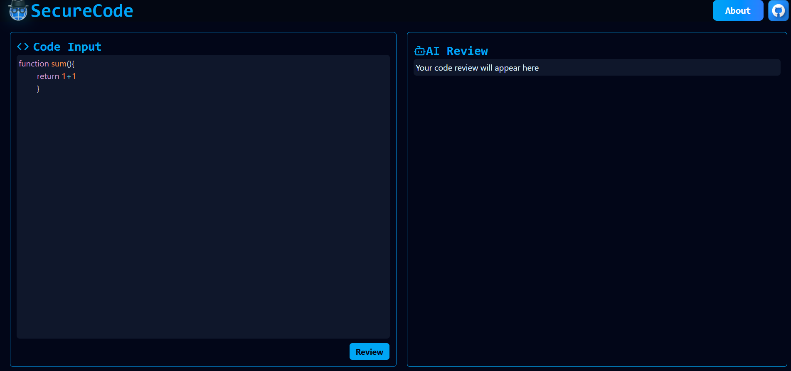

# SecureCode

<div align="center">
  
  
  <h3>AI-Powered Code Security & Quality Platform</h3>
  <p><em>Identify vulnerabilities, optimize performance, and ensure compliance before production</em></p>

  
  
  
  
</div>

---

## 🌟 Overview

SecureCode is an AI-powered code review platform that helps developers ensure code security and quality.
It detects vulnerabilities, suggests performance optimizations, and checks compliance—all before deployment.
This repo contains the front-end of the landing page, built with modern tech for a seamless user experience.


> **⚠️ Important Note**:  Note: All stats shown are for demo purposes only and do not reflect real platform performance or data.

---

## ✨ Key Features

<table>
  <tr>
    <td width="50%">
      <h3>🤖 AI-Powered Analysis</h3>
      <p>Advanced machine learning algorithms deliver comprehensive code insights with intelligent vulnerability detection and optimization recommendations.</p>
    </td>
    <td width="50%">
      <h3>🛡️ Enterprise Security</h3>
      <p>Military-grade security scanning with OWASP compliance, featuring zero-day threat protection and advanced vulnerability assessment.</p>
    </td>
  </tr>
  <tr>
    <td width="50%">
      <h3>⚡ Lightning Performance</h3>
      <p>Sub-second analysis powered by distributed computing infrastructure, ensuring comprehensive reviews without workflow disruption.</p>
    </td>
    <td width="50%">
      <h3>🌐 Universal Language Support</h3>
      <p>Native support for 25+ programming languages with context-aware analysis tailored to each language's best practices and frameworks.</p>
    </td>
  </tr>
</table>

---


### Three Simple Steps:

1. **📤 Upload & Analyze**  
   Securely upload your code through our encrypted interface or integrate seamlessly with your CI/CD pipeline for automated scanning.

2. **🔍 AI Deep Scan**  
   Our neural networks perform multi-layered analysis covering security vulnerabilities, performance bottlenecks, maintainability issues, and compliance requirements.

3. **📊 Actionable Insights**  
   Receive prioritized recommendations with detailed explanations, practical code examples, and automated fix suggestions.

---

## 📸 Platform Preview

<div align="center">
  <table>
    <tr>
      <td align="center">
        <strong>Landing page</strong><br/>
        
      </td>
      <td align="center">
        <strong>Home page </strong><br/>
        
      </td>
    </tr>
  </table>
</div>


## 🧠 AI Integration

This project showcases the integration of **Google Gemini** AI technology, demonstrating how advanced artificial intelligence can be seamlessly incorporated into modern web applications to deliver powerful code analysis capabilities.

---

## 🛠️ Technology Stack

<div align="center">
  <table>
    <tr>
      <td align="center" width="25%">
        
        <br><strong>React</strong>
        <br><em>UI Library</em>
      </td>
      <td align="center" width="25%">
        
        <br><strong>Tailwind CSS</strong>
        <br><em>Styling Framework</em>
      </td>
      <td align="center" width="25%">
        
        <br><strong>Framer Motion</strong>
        <br><em>Animation Library</em>
      </td>
      <td align="center" width="25%">
        
        <br><strong>Vite</strong>
        <br><em>Build Tool</em>
      </td>
    </tr>
  </table>
</div>

---

## 🚀 Quick Start

### Prerequisites
- Node.js (v16.0 or higher)
- npm or yarn package manager

### Installation

1. **Clone the repository**
   ```bash
   git clone https://github.com/aryanx16/SecureCode.git
   cd SecureCode
   ```

2. **Install dependencies**
   ```bash
   cd frotend
   npm install
   cd backend
   npm install
   # or
   yarn install
   ```

3. **Start development server**
   ```bash
   npm run dev
   # or
   yarn dev
   ```

4. **Open in browser**
   ```
   http://localhost:5173
   ```

### Available Scripts

| Command | Description |
|---------|-------------|
| `npm run dev` | Start development server |
| `npm run build` | Build for production |
| `npm run preview` | Preview production build |
| `npm run lint` | Run ESLint |

---

## 🤝 Contributing

We welcome contributions from the community! Here's how you can help:

1. **🍴 Fork the repository**
2. **🌟 Create your feature branch** (`git checkout -b feature/AmazingFeature`)
3. **💾 Commit your changes** (`git commit -m 'Add some AmazingFeature'`)
4. **📤 Push to the branch** (`git push origin feature/AmazingFeature`)
5. **🔀 Open a Pull Request**

### Contribution Guidelines
- Follow the existing code style and conventions
- Write clear, concise commit messages
- Update documentation as needed
- Add tests for new features when applicable

---

## 📄 License

This project is licensed under the **MIT License** - see the [LICENSE](LICENSE) file for details.

---

## 📬 Contact & Support
<div align="center">
  
**Aryan Babare**  
💌 [aryanx16@gmail.com](mailto:aryanx16@gmail.com)  
🐙 [GitHub Profile](https://github.com/aryanx16)  

---

<p><em>⭐ If you found this project helpful, please consider giving it a star!</em></p>

</div>

---

<div align="center">
  <sub>Built with ❤️ by <a href="https://github.com/aryanx16">Aryan Babare</a></sub>
</div>